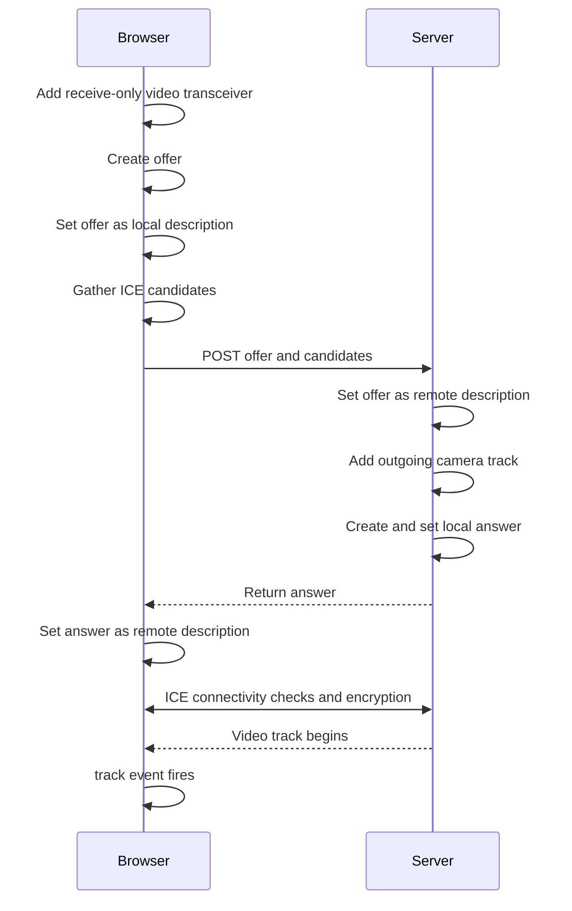

## take home fpga project

This is Gerard's application to get in. 

### Requirements:

need to have npm and uv. 

### How to run:

go into the server folder and then run:

```
uv run main.py
```

and you should be good. 

in another terminal, go into the dashboard folder and run:

```
npm i
npm run dev
```


this will start up the dashboard and you should see yourself
with the facial detection. 


### Structure:

dashboard: this dashboard is just Vite running the index.html and a main.js
that interacts with the server to stream the video. 
i chose the main.js to be as simple as possible, cause lowkey i was lazy and 
i didn't want to have to make it all fancy looking. i just want it to work.
codex also did all of that for me, i just double checked how it requested
to the server. it basically waits for a track from the server and displays it. 
you can also take a look at my commits before this as i like to keep my commit 
messages rather long and detailed. check those out for more information.

server: this server is a FastAPI server that runs 2 threads, one for the main
server to expose an endpoint to initiate WebRTC and another to run the actual
camera and face detection ai inference. This basically does the opposite of the 
dashboard, and instead creates its own track CameraVideoTrack to be processed
by the aiortc library that handles sending the frames and dealing wiht 
connectivity for us. The other thread has the camera, running from opencv and
using insight face's buffalo-l model to do basic face detection. i can even 
add like facial recognition here as well quite easily as the python package
comes with a lot built in out of the box. 

here is a basic flow of what is happening at a high level, thank you codex:




but yeah this is my project, very basic. please check the 
commits for more details on explanation but it was really general. i lowkey
don't know that much about webrtc and how complicated it could getjjj.

